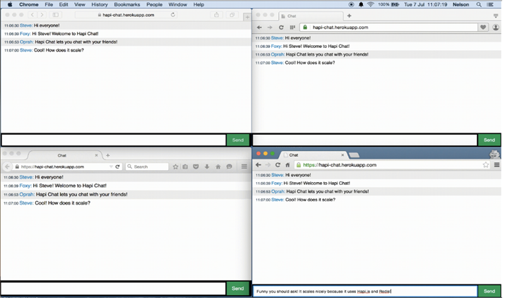

# Node Socket Example
Node Js Chat Socket IO Example
This is a sampe application to demonstrate a sample chat system using NodeJs socket.io programming. The complete explanation and walk through of the code is avilable on blog - [Node JS Socket IO Chat Example](http://www.devglan.com/node-js/nodejs-chat-socket-io-example)



## Running the application
Assuming that node Js is already installed, traverse to the project location and execute the command - node index.js and hit the url (http://localhost:8080) to access the vhat application.


```sh
socket.emit('message', "this is a test"); # //sending to sender-client only
socket.broadcast.emit('message', "this is a test"); # //sending to all clients except sender
socket.broadcast.to('game').emit('message', 'nice game'); # //sending to all clients in 'game' room(channel) except sender
socket.to('game').emit('message', 'enjoy the game'); # //sending to sender client, only if they are in 'game' room(channel)
socket.to('game1').to('game2').emit('nice game', "let's play a game (too)"); # // sending to all clients in 'game1' and/or in 'game2' room, except sender
io.to(`${socketId}`).emit('hey', 'I just met you'); # //sending to individual socketid (private message)
io.emit('message', "this is a test"); # //sending to all clients, include sender
io.in('game').emit('message', 'cool game'); # //sending to all clients in 'game' room(channel), include sender
io.of('myNamespace').emit('message', 'gg'); # //sending to all clients in namespace 'myNamespace', include sender
io.of('myNamespace').to('room').emit('event', 'message'); # // sending to a specific room in a specific namespace, including sender
socket.emit(); # //send to all connected clients
socket.broadcast.emit(); # //send to all connected clients except the one that sent the message
socket.on(); # //event listener, can be called on client to execute on server
io.sockets.socket(); # //for emiting to specific clients
io.sockets.emit(); # //send to all connected clients (same as socket.emit)
io.sockets.on() ; # //initial connection from a client.
```

**Note:** The following events are reserved and should not be used as event names by your application:
- `error`
- `connect`
- `disconnect`
- `disconnecting`
- `newListener`
- `removeListener`
- `ping`
- `pong`
